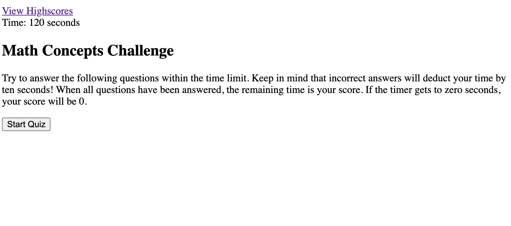
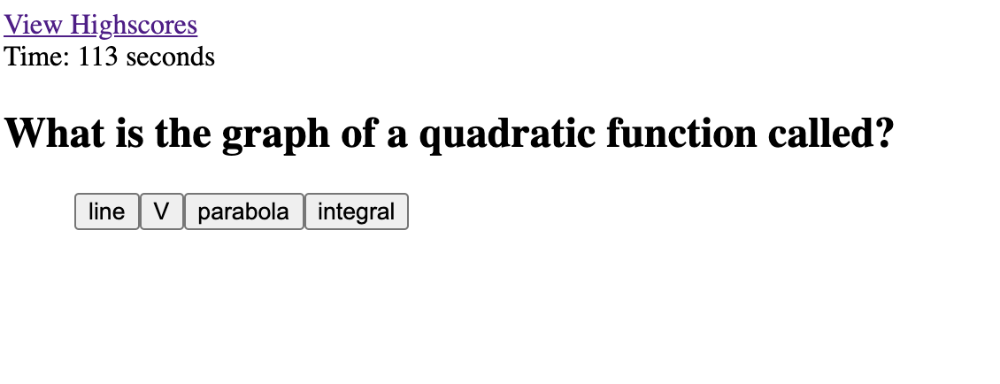

# Math-Concepts-Quiz-HW

## Description

A user answers multiple-choice math-related questions and the computer locally stores if their answer was right or wrong. The user has two minutes to answer all the questions, and they can see the timer counting down. If the user answers a question incorrectly, the timer will deduct an additional 10 seconds from the remaining time. When the user has answered all the questions OR time runs out, they are given the option of typing in their initials and storing that to a 'highscores' list.

## Assets

The following image is a screenshot of the html file loaded in a browser.

The following image is a screenshot of the first question, as an example.

## Link to Live Url

Click below to open the actual link.

[Test Your Recollection of Math Concepts](https://audrey-g37.github.io/Math-Concepts-Quiz-HW/)
